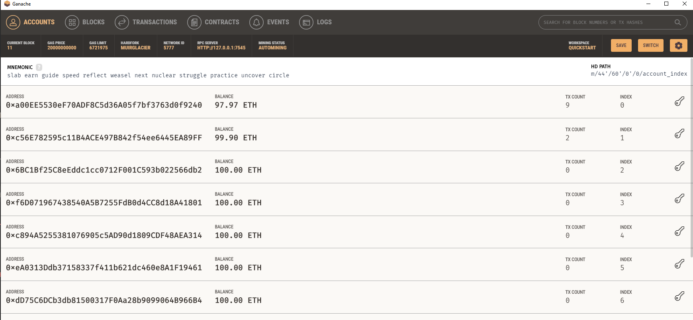
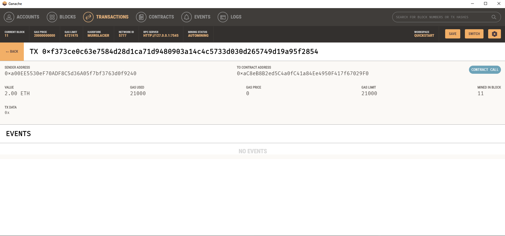

### Background

You work at a startup that is building a new and disruptive platform called Fintech Finder. Fintech Finder is an application that its customers can use to find fintech professionals from among a list of candidates, hire them, and pay them. As Fintech Finder’s lead developer, you have been tasked with integrating the Ethereum blockchain network into the application in order to enable your customers to instantly pay the fintech professionals whom they hire with cryptocurrency.

In this Challenge, you will complete the code that enables your customers to send cryptocurrency payments to fintech professionals. To develop the code and test it out, you will assume the perspective of a Fintech Finder customer who is using the application to find a fintech professional and pay them for their work.

### Files
[Fintech Application Python File](fintech_finder.py)

[Imported Wallet Python File](crypto_wallet.py)

### Screenshots

Here is the application screenshot showing the choices as well as the input values and results:

Here is a screenshot of the Ganache Showing the account info, the first account is the one used for the transaction seen in the screenshot above:

Here is a screenshot of the actual transaction as seen in Ganache:

